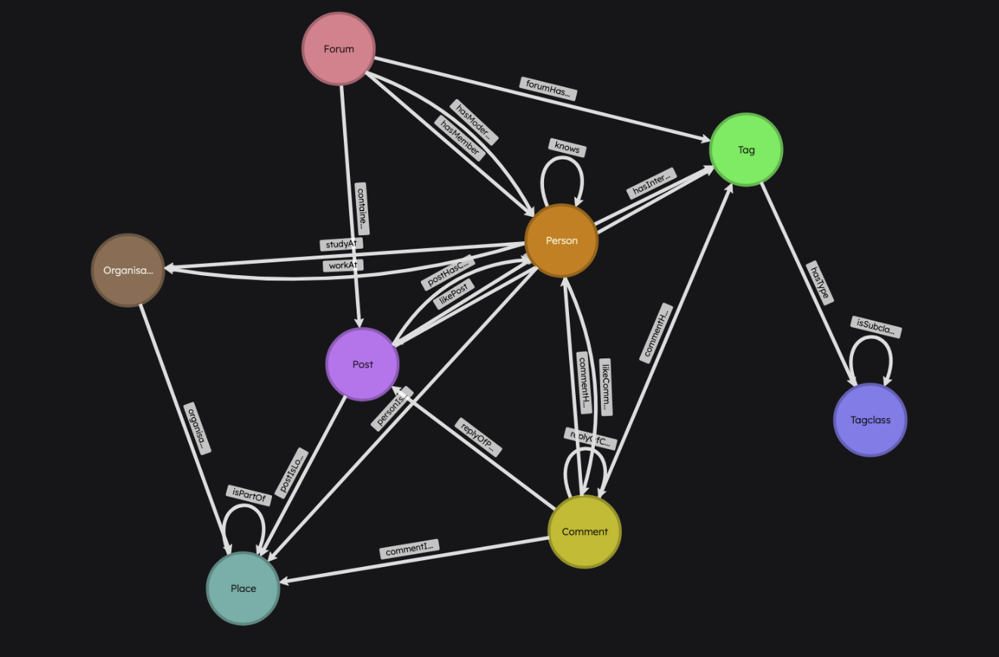
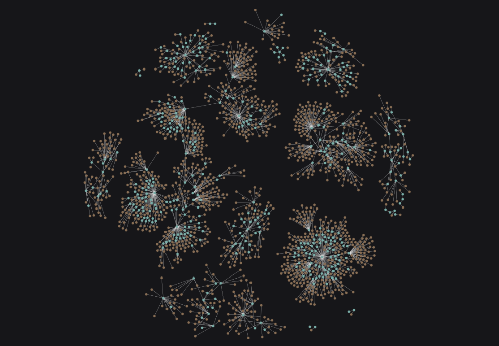

# Graph benchmarks: LDBC SNB SF1

This repo contains LDBC Social Network Benchmarks (SNB) with a scale factor of 1 (SF1). The dataset is downloaded from [the official source](https://ldbcouncil.org/benchmarks/snb/datasets/).

The aim of this benchmark is to study and compare the performance of graph systems on an established benchmark dataset. The queries suite run consists of 30 queries that touch various nodes via n-hop path traversals, with very different cardinalities, filters and projections applied to get a more holistic understanding of query performance.

The following systems are compared:
- Neo4j
- Kuzu (now archived)
- Ladybug
- lance-graph

## Setup

We use [uv](https://docs.astral.sh/uv/getting-started/installation/) to manage the dependencies.

```sh
# Sync the dependencies locally
uv sync
```
All the dependencies are listed in `pyproject.toml`.

## Dataset

Download the LDBC dataset locally by running the given Python script `download_dataset.py`

```bash
uv run download_dataset.py
```

Alternatively, navigate to the [LDBC site](https://ldbcouncil.org/benchmarks/snb/datasets/) and manually download and unzip the dataset from [this URL](https://datasets.ldbcouncil.org/snb-interactive-v1/social_network-sf1-CsvComposite-StringDateFormatter.tar.zst).

The schema of the LDBC SNB graph is shown below. There are 8 node types and 23 relationship types in the graph.



The individual and total number of nodes and relationships in the graph asre shown below.

```
Node counts:
- Comment: 2052169
- Forum: 90492
- Organisation: 7955
- Person: 9892
- Place: 1460
- Post: 1003605
- Tag: 16080
- Tagclass: 71

Relationship counts:
- commentHasCreator: 2052169
- commentHasTag: 2698393
- commentIsLocatedIn: 2052169
- containerOf: 1003605
- forumHasTag: 309766
- hasInterest: 229166
- hasMember: 1611869
- hasModerator: 90492
- hasType: 16080
- isPartOf: 1454
- isSubclassOf: 70
- knows: 180623
- likeComment: 1438418
- likePost: 751677
- organisationIsLocatedIn: 7955
- personIsLocatedIn: 9892
- postHasCreator: 1003605
- postHasTag: 713258
- postIsLocatedIn: 1003605
- replyOfComment: 1040749
- replyOfPost: 1011420
- studyAt: 7949
- workAt: 21654

Totals:
- nodes: 3181724
- relationships: 17256038
```

In total, there are 3.1M nodes and 17M relationships for the SF1 variant of this dataset.

## Ingest the data as a graph

Navigate to the individual directories to see the instructions on how to ingest the data into each graph system.
Once constructed, the graph is well-connected and has rich relationships between nodes of different types.



## Queries

Navigate to each directory and see the `query.py` files for
each of the 30 queries run in the benchmark.

## High-level results

| Query | neo4j-2025.12.1 (ms) | kuzu-0.11.3 (ms) | ladybug-0.14.1 (ms) | lance-graph-0.5.0 (ms) |
| --- | --- | --- | --- | --- |
| q1 | 6ms | 2ms (2.4x) | 2ms (2.7x) | 23ms (0.2x) |
| q2 | 6ms | 1ms (4.4x) | 2ms (4.2x) | 24ms (0.3x) |
| q3 | 3ms | 1ms (2.1x) | 1ms (2.2x) | 25ms (0.1x) |
| q4 | 5ms | 1ms (4.6x) | 1ms (4.3x) | 25ms (0.2x) |
| q5 | 5ms | 4ms (1.3x) | 4ms (1.4x) | 23ms (0.2x) |
| q6 | 4ms | 1ms (5.1x) | 1ms (4.6x) | 22ms (0.2x) |
| q7 | 2ms | 31ms (0.1x) | 31ms (0.1x) | 34ms (0.1x) |
| q8 | 16ms | 3ms (5.6x) | 3ms (5.5x) | 23ms (0.7x) |
| q9 | 3ms | 2ms (1.3x) | 2ms (1.2x) | 23ms (0.1x) |
| q10 | 5ms | 2ms (2.7x) | 2ms (2.6x) | 46ms (0.1x) |
| q11 | 13ms | 8ms (1.6x) | 8ms (1.5x) | 25ms (0.5x) |
| q12 | 5ms | 18ms (0.3x) | 18ms (0.3x) | 40ms (0.1x) |
| q13 | 9ms | 50ms (0.2x) | 52ms (0.2x) | 30ms (0.3x) |
| q14 | 2ms | 2ms (1.0x) | 2ms (0.9x) | 24ms (0.1x) |
| q15 | 3ms | 3ms (1.2x) | 3ms (1.2x) | 24ms (0.1x) |
| q16 | 2ms | 2ms (1.0x) | 2ms (1.0x) | 26ms (0.1x) |
| q17 | 5ms | 3ms (1.8x) | 3ms (1.8x) | 24ms (0.2x) |
| q18 | 4ms | 2ms (2.3x) | 2ms (2.3x) | 23ms (0.2x) |
| q19 | 6ms | 13ms (0.5x) | 14ms (0.5x) | 41ms (0.1x) |
| q20 | 422ms | 12ms (35.2x) | 11ms (38.1x) | 24ms (17.5x) |
| q21 | 2ms | 1ms (2.7x) | 1ms (2.7x) | 23ms (0.1x) |
| q22 | 4ms | 20ms (0.2x) | 21ms (0.2x) | 34ms (0.1x) |
| q23 | 4ms | 1ms (2.9x) | 1ms (2.8x) | 24ms (0.2x) |
| q24 | 2ms | 2ms (1.0x) | 2ms (1.0x) | 24ms (0.1x) |
| q25 | 3ms | 2ms (1.9x) | 2ms (1.8x) | 23ms (0.1x) |
| q26 | 2ms | 4ms (0.5x) | 4ms (0.5x) | 25ms (0.1x) |
| q27 | 3ms | 13ms (0.3x) | 16ms (0.2x) | 45ms (0.1x) |
| q28 | 4ms | 2ms (2.6x) | 2ms (2.3x) | 25ms (0.2x) |
| q29 | 3ms | 1ms (2.4x) | 1ms (2.4x) | 25ms (0.1x) |

Q30 is the most expensive query of all, and was not run for this stage of the benchmark, because lance-graph's query planner doesn't yet support it. Stay tuned as more updates come along!

> [!NOTE]
> The lance-graph query processor is undergoing significant optimization and a new version of the query planner is on the way soon. The numbers here are artificially large because several queries had to be rewritten to materialize results prematurely, with aggregations done externally so as to bypass (as yet) unsupported Cypher syntax in lance-graph. As a result, these results should be treated as a moving target -- follow this repo and check back in soon!