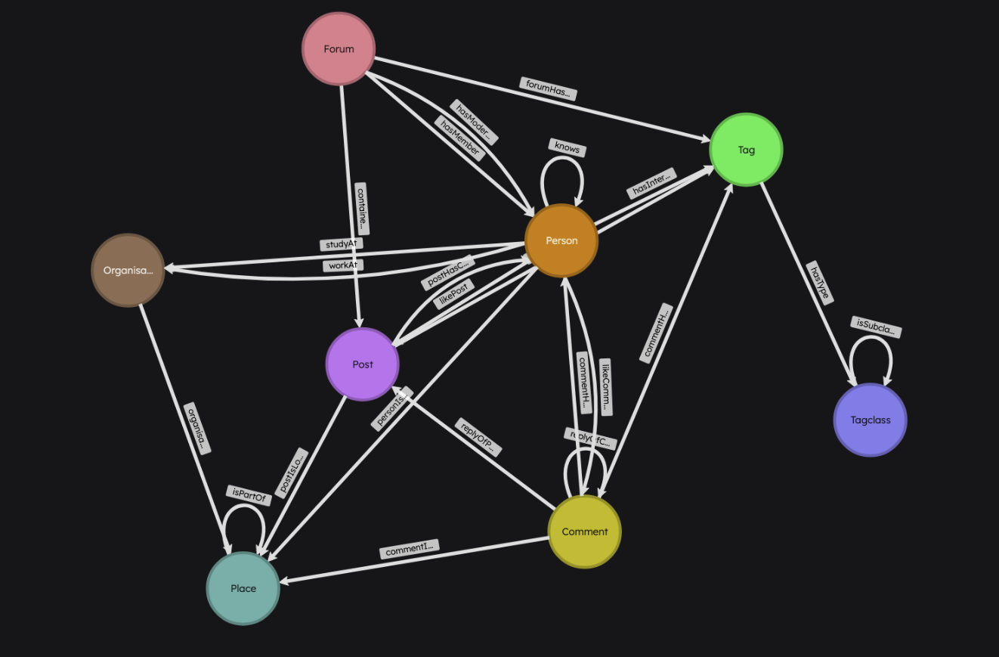
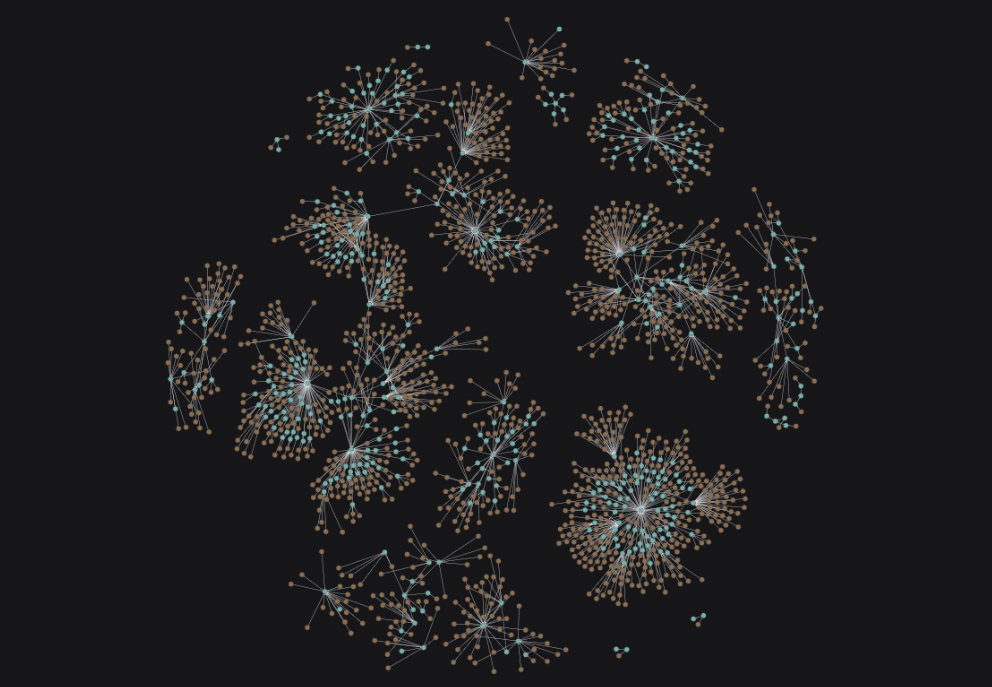

# Graph benchmarks: LDBC SNB SF1

This repo contains a custom graph benchmark using the LDBC Social Network Benchmark (SNB) dataset with a scale factor of 1 (SF1). The dataset is downloaded from [the official source](https://ldbcouncil.org/benchmarks/snb/datasets/). This project complies with [LDBC's fair use policies](https://ldbcouncil.org/benchmarks/fair-use-policies/).

LDBC's policy calls for attribution in accordance with the [Creative Commons Attribution 4.0 International (CC BY 4.0) license](https://creativecommons.org/licenses/by/4.0/). We credit LDBC/GDC for the SNB dataset and data model used here. This repository's original code and custom queries are licensed under [MIT](LICENSE); LDBC materials retain their applicable upstream licenses and are not relicensed under MIT.

The aim of this benchmark is to study and compare the performance of graph systems on an established benchmark dataset. The queries suite run consists of 30 queries that touch various nodes via n-hop path traversals, with very different cardinalities, filters and projections applied to get a more holistic understanding of query performance.

> [!NOTE]
> The query workload was created specifically for this benchmark and is not officially endorsed by LDBC, now known as the Graph Data Council (GDC). This is not an exact re-implementation of an LDBC Benchmark, and the results reported here are not "official" LDBC Benchmark Results.

The following systems are compared:
- Neo4j
- Kuzu (now archived)
- Ladybug
- lance-graph

## Setup

We use [uv](https://docs.astral.sh/uv/getting-started/installation/) to manage the dependencies.

```sh
# Sync the dependencies locally
uv sync
```
All the dependencies are listed in `pyproject.toml`.

## Dataset

Download the LDBC dataset locally by running the given Python script `download_dataset.py`

```bash
uv run download_dataset.py
```

Alternatively, navigate to the [LDBC site](https://ldbcouncil.org/benchmarks/snb/datasets/) and manually download and unzip the dataset from [this URL](https://datasets.ldbcouncil.org/snb-interactive-v1/social_network-sf1-CsvComposite-StringDateFormatter.tar.zst).

The schema of the LDBC SNB graph is shown below. There are 8 node types and 23 relationship types in the graph.



The individual and total number of nodes and relationships in the graph asre shown below.

```
Node counts:
- Comment: 2052169
- Forum: 90492
- Organisation: 7955
- Person: 9892
- Place: 1460
- Post: 1003605
- Tag: 16080
- Tagclass: 71

Relationship counts:
- commentHasCreator: 2052169
- commentHasTag: 2698393
- commentIsLocatedIn: 2052169
- containerOf: 1003605
- forumHasTag: 309766
- hasInterest: 229166
- hasMember: 1611869
- hasModerator: 90492
- hasType: 16080
- isPartOf: 1454
- isSubclassOf: 70
- knows: 180623
- likeComment: 1438418
- likePost: 751677
- organisationIsLocatedIn: 7955
- personIsLocatedIn: 9892
- postHasCreator: 1003605
- postHasTag: 713258
- postIsLocatedIn: 1003605
- replyOfComment: 1040749
- replyOfPost: 1011420
- studyAt: 7949
- workAt: 21654

Totals:
- nodes: 3181724
- relationships: 17256038
```

In total, there are 3.1M nodes and 17M relationships for the SF1 variant of this dataset.

## Ingest the data as a graph

Navigate to the individual directories to see the instructions on how to ingest the data into each graph system.
Once constructed, the graph is well-connected and has rich relationships between nodes of different types.



## Queries

Navigate to each directory and see the `query.py` files for
each of the 30 queries run in the benchmark.

## High-level results

Latest Ladybug measurements: **2026-09-11** (other engines: **2026-09-03**), on an Apple M5 with 10 logical CPUs and 24 GiB RAM, running macOS 26.6.2 and Python 3.13.14. Each engine has a completed 30-query suite, with all assertions passing and at least five measured rounds per query.

Ladybug is pinned to **0.20.4**. All 30 queries now use plain `conn.execute(query)`, with Q11’s cache toggles and the shared dummy-parameter workaround removed. `ANALYZE`, result cleanup and the six ART secondary indexes remain enabled. Q11 passed 20 consecutive plain executions and 20 executions reusing one prepared statement. These timings use the plain-query driver path rather than the previous forced prepared-statement path.

Kuzu, Lance Graph and Neo4j values are from the earlier full-suite runs on the same machine; their query, benchmark and ingestion sources are unchanged on main. Neo4j ran in a native-arm64 Colima VM with 4 CPUs and 10 GiB RAM, using the existing heap/page-cache settings. Embedded engines ran natively with the VM stopped. These compare the stated deployment configurations, not equal resource limits or controlled cold caches.

[Run summary and raw JSON](results/20260911T210000Z/summary.md) · [Run notes](results/20260911T210000Z/run-notes.md)

### Benchmark settings

Run from each engine directory:

```sh
uv run --frozen pytest benchmark_query.py \
  --benchmark-min-rounds=5 \
  --benchmark-min-time=0.000005 \
  --benchmark-max-time=1.0 \
  --benchmark-timer=time.perf_counter \
  --benchmark-calibration-precision=10 \
  --benchmark-warmup=off \
  --benchmark-warmup-iterations=5 \
  --benchmark-disable-gc \
  --benchmark-sort=fullname
```

The runs use pytest-benchmark 5.2.3. Five rounds is a minimum, not an exact count. Query result conversion and printing remain inside the timed functions; calibration is enabled and warmup is disabled. All four graphs were verified to contain 3,181,724 nodes and 17,256,038 relationships, with expected indexes ready before timing.

### Mean query latency

Times are in milliseconds. Parenthesized ratios are Neo4j mean / engine mean; values above 1 indicate faster execution than this Neo4j setup.

| Query | neo4j-2025.12.1 (ms) | kuzu-0.11.3 (ms) | ladybug-0.20.4 (ms) | lance-graph-0.5.4 (ms) |
| --- | ---: | ---: | ---: | ---: |
| q1 | 4.098 | 1.716 (2.39x) | 1.873 (2.19x) | 1.281 (3.20x) |
| q2 | 5.082 | 1.313 (3.87x) | 0.850 (5.98x) | 2.266 (2.24x) |
| q3 | 2.018 | 1.023 (1.97x) | 1.160 (1.74x) | 1.840 (1.10x) |
| q4 | 3.141 | 0.855 (3.67x) | 0.389 (8.08x) | 2.912 (1.08x) |
| q5 | 4.244 | 3.419 (1.24x) | 3.624 (1.17x) | 1.986 (2.14x) |
| q6 | 3.145 | 0.705 (4.46x) | 0.779 (4.04x) | 0.706 (4.46x) |
| q7 | 1.508 | 27.588 (0.05x) | 30.354 (0.05x) | 15.430 (0.10x) |
| q8 | 11.720 | 2.651 (4.42x) | 2.799 (4.19x) | 1.139 (10.29x) |
| q9 | 1.782 | 1.712 (1.04x) | 1.268 (1.40x) | 1.878 (0.95x) |
| q10 | 3.514 | 1.511 (2.33x) | 23.228 (0.15x) | 27.044 (0.13x) |
| q11 | 10.935 | 7.735 (1.41x) | 8.789 (1.24x) | 3.043 (3.59x) |
| q12 | 3.888 | 17.120 (0.23x) | 25.503 (0.15x) | 18.705 (0.21x) |
| q13 | 8.398 | 42.157 (0.20x) | 41.396 (0.20x) | 9.465 (0.89x) |
| q14 | 1.288 | 1.464 (0.88x) | 1.772 (0.73x) | 2.432 (0.53x) |
| q15 | 2.603 | 2.299 (1.13x) | 2.666 (0.98x) | 2.114 (1.23x) |
| q16 | 1.418 | 1.735 (0.82x) | 4.362 (0.33x) | 3.910 (0.36x) |
| q17 | 3.119 | 2.553 (1.22x) | 2.851 (1.09x) | 2.220 (1.41x) |
| q18 | 2.739 | 1.441 (1.90x) | 1.316 (2.08x) | 1.741 (1.57x) |
| q19 | 5.189 | 13.232 (0.39x) | 13.582 (0.38x) | 19.478 (0.27x) |
| q20 | 393.291 | 13.666 (28.78x) | 13.136 (29.94x) | 2.828 (139.05x) |
| q21 | 1.336 | 0.445 (3.00x) | 0.504 (2.65x) | 1.456 (0.92x) |
| q22 | 2.618 | 21.507 (0.12x) | 17.745 (0.15x) | 13.224 (0.20x) |
| q23 | 3.081 | 1.151 (2.68x) | 0.652 (4.73x) | 2.510 (1.23x) |
| q24 | 1.291 | 1.191 (1.08x) | 0.832 (1.55x) | 1.706 (0.76x) |
| q25 | 2.579 | 1.388 (1.86x) | 1.047 (2.46x) | 1.308 (1.97x) |
| q26 | 1.222 | 3.280 (0.37x) | 3.160 (0.39x) | 3.014 (0.41x) |
| q27 | 2.518 | 14.305 (0.18x) | 16.337 (0.15x) | 24.665 (0.10x) |
| q28 | 3.033 | 1.457 (2.08x) | 1.828 (1.66x) | 2.547 (1.19x) |
| q29 | 2.359 | 0.965 (2.45x) | 0.615 (3.84x) | 2.645 (0.89x) |
| q30 | 1055.151 | 153.493 (6.87x) | 343.570 (3.07x) | 35.090 (30.07x) |

Latest CLI outputs: [Neo4j](results/neo4j-2025.12.1.txt), [Kuzu](results/kuzu-0.11.3.txt), [Ladybug 0.20.4](results/ladybug-0.20.4.txt), [Lance Graph](results/lance-graph-0.5.4.txt).

Previous Ladybug CLI output: [0.20.2 archive](results/archived/ladybug-0.20.2.txt).
